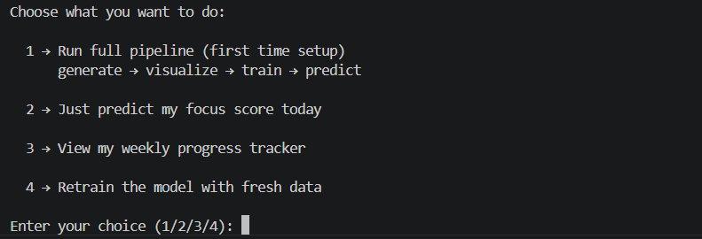

# Focus Level Detector for Students

## About the Project

This project is based on a simple observation I had during my own study routine, Sometimes I study for hours but still don’t feel productive while other times even a short session feels focused.

Instead of guessing the reason, I wanted to actually measure what affects focus. So I built a small machine learning model that predicts a student's focus level based on their daily habits.

---

## What This Project Does

The model takes a few basic inputs related to a student’s routine:

* Study hours
* Sleep hour
* Phone usage
* Break time

Based on this, it predicts a **focus score out of 100**.

Along with that, it also:

* Classifies focus as Low/Medium/High
* Gives simple suggestions to improve focus
* Stores data to show how focus changes over time

---

## Why I Chose This Problem

As a student, I noticed that we often blame external things for lack of focus but rarely look at our own habits like sleep or phone usage.

This project is an attempt to connect those daily habits with actual productivity in a simple and understandable way.

---

## Dataset
I created the dataset myself instead of using any online dataset.

The focus score was generated using a basic logic:

* More sleep - better focus
* More study hours - better focus
* Too much phone usage - reduces focus
* Balanced breaks - improve focus

I generated around 200 entries with a mix of:

* good habits
* average habits
* poor habits

Some randomness was added to make the data more realistic.

---

## Machine Learning Model

I used two models and compared them:

### 1. Linear Regression

* Simple and works well when relationships are mostly linear
* Gave better accuracy in this project

### 2. Decision Tree Regressor

* More flexible but slightly less accurate here

After testing, **Linear Regression performed better** so I used it for final predictions.

---
## Libraries Used

- pandas — data handling and CSV operations
- numpy — numerical calculations and array operations
- matplotlib — graph plotting
- seaborn — statistical visualisation
- scikit-learn — machine learning models and evaluation metrics
- pickle — saving and loading the trained model


## Output

For each input, the system gives:

* Focus Score (0–100)
* Focus Level (Low / Medium / High)
* Suggestions for improvement

---

## How to Run the Project

1. Clone the repository
2. Install required libraries:

   ```
   pip install pandas scikit-learn matplotlib
   ```
3. Run the main file:

   ```
   python main.py
   ```

## Program Interface

When the program runs, the user is given multiple options to choose from:

- Run the full pipeline (data generation → training → prediction)
- Predict focus score directly
- View weekly progress
- Retrain the model

Below is how the interface looks:



---


## What I Learned

* Basics of regression models
* How dataset design affects model performance
* Difference between training and testing data
* How small habits can be translated into measurable outputs

---

## Future Improvements

* Add a simple UI for input
* Use real user data instead of generated data
* Improve suggestion system

---

## Final Note

This project is not meant to be perfectly accurate, but to give a practical idea of how daily habits can impact focus using machine learning.
